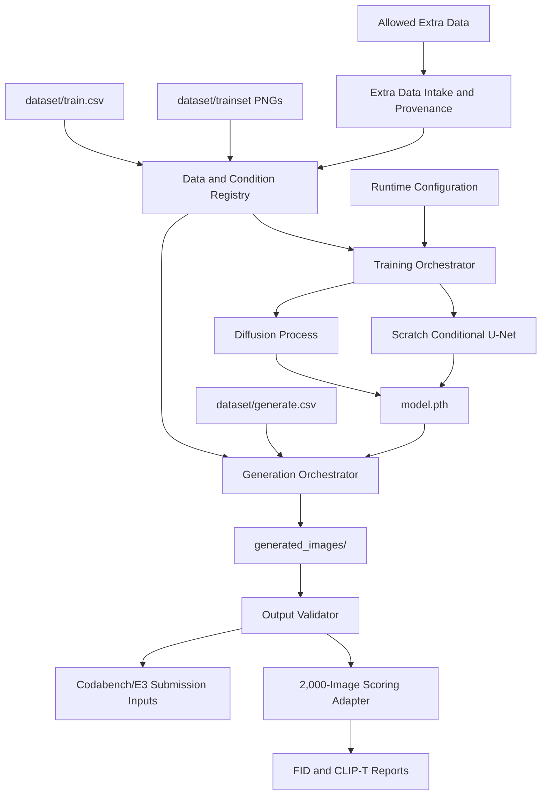

# High-Level Design

## Overview

This design defines a reproducible, from-scratch conditional image generation system for HW6 Brainrot Image Generation. The system trains a pixel-space conditional DDPM on the local Brainrot training dataset and generates the required 2,000 64x64 PNG images from `dataset/generate.csv`.

The primary architecture is a small set of Python modules under `scripts/`:

- A data and condition registry for CSV parsing, image loading, and animal/object/pair mapping.
- A scratch conditional denoising model.
- A diffusion process layer for training loss and sampling.
- A training orchestrator with progress reporting and multi-GPU support.
- A generation orchestrator with progress reporting and multi-GPU support.
- A generated-output validator.
- A 2,000-image scoring adapter for development metrics.
- Optional packaging support for final submission.

The main model path must not use pretrained weights, existing model checkpoints, ready-made generation pipelines, auxiliary pretrained CLIP/VAE conditioning, or copied public homework solutions. PyTorch is the supported implementation base because the repository scorer already uses PyTorch and the proposal selects PyTorch for the scratch DDPM implementation.

The optimization objective is to lower FID and raise CLIP-T, with correctness and reproducibility treated as submission gates rather than optional checks.

Sources: `doc/proposal.md` Objective, Constraints, Proposed Approach, Module Candidates; `doc/problem-brief.md` Assignment Objective, Constraints, Required Outputs; `doc/repo-map.md` Runtime or CLI Entry Points, Missing or Ambiguous Areas; user requirement for training/generation progress reporting, multi-GPU support, no pretrained/existing models, 2,000-image scoring, and FID/CLIP-T optimization.

## Goals

- Train a conditional image generation model from scratch for 10 animals, 10 objects, and 100 animal-object pairs.
- Generate exactly 2,000 PNG images matching the IDs and conditions in `dataset/generate.csv`.
- Preserve the strict output contract: correct filenames, 64x64 resolution, RGB PNG format, and one file per generation request.
- Keep training and generation reproducible for teaching assistant verification.
- Provide visible progress and timing feedback for both training and image generation.
- Support multi-GPU execution for both training and generation while still allowing a single-GPU path.
- Use up to 4 NVIDIA GeForce RTX 3090 24GB GPUs out of the available 8 GPUs.
- Score the generated 2,000 images during development for FID and CLIP-T when scorer inputs are available or adapted.
- Use extra training data if it is allowed and can be tracked reproducibly.
- Optimize for lower FID and higher CLIP-T after the output contract is satisfied.

Sources: `doc/proposal.md` Objective, Algorithm Strategy, Correctness Strategy, Performance Strategy, Milestones; `doc/problem-brief.md` Required Outputs, Constraints; user answers on GPU budget, scoring, extra data, and target metrics.

## Non-Goals

- Do not use pretrained generative weights or high-level generative model pipelines as the main model.
- Do not use pretrained or existing models for the generator, auxiliary conditioning, training targets, image filtering, or image reranking.
- Do not copy public homework solutions or public repository code into the project.
- Do not make hidden test data part of the training, validation, or generation flow.
- Do not modify `scoring_program/score.py` as part of the generation architecture unless a separate scoring task requires it.
- Do not make the local scorer the source of truth over Codabench for final grading.
- Do not treat evaluator-only pretrained models used by the official scorer as part of the trainable generation solution.

Sources: `doc/proposal.md` Objective, Constraints, Alternatives Considered; `doc/problem-brief.md` Constraints, Evaluation or Grading Criteria; user answer disallowing pretrained or existing models.

## Requirements Summary

| Area | Requirement | Source |
| --- | --- | --- |
| Data | Use `dataset/train.csv`, `dataset/generate.csv`, and `dataset/trainset/` as the core local inputs. | `doc/proposal.md` Current Project State |
| Model | Implement a scratch conditional DDPM for 64x64 RGB images. | `doc/proposal.md` Proposed Approach |
| Conditioning | Condition on animal/object information, represented at minimum as 100 animal-object pair IDs. | `doc/proposal.md` Algorithm Strategy |
| Output | Generate exactly 2,000 64x64 RGB PNG files with filenames from `dataset/generate.csv`. | `doc/problem-brief.md` Required Outputs |
| Reproducibility | Save the trained model used for generation as `model.pth` and document commands/seeds in `README.md`. | `doc/problem-brief.md` Required Deliverables; `doc/proposal.md` Milestones |
| Progress visibility | Training and generation must show progress and timing through both console progress and persistent logs. | User requirement and follow-up answer |
| Multi-GPU | Training and generation must support up to 4 selected RTX 3090 GPUs, with a single-GPU fallback. | User follow-up answer |
| Extra data | Default to the provided `dataset/` plus class-preserving augmentation; allow external extra data only if it is legal, reproducible, manually/provenance-labeled, and improves validation/Codabench results. | `doc/problem-brief.md` Constraints; user follow-up answers |
| Validation | Provide a generated-output checker for count, names, PNG format, and image dimensions. | `doc/proposal.md` Validation Plan |
| Scoring | Score the generated 2,000-image set for FID and CLIP-T during development; Codabench remains authoritative. | User follow-up answer; `doc/problem-brief.md` Evaluation or Grading Criteria |
| Dependencies | Add a `requirements.txt` compatible with `pip` when implementation begins. | `doc/problem-brief.md` Required Outputs; `AGENTS.md` |
| Submission ID | Use student ID `314511048`, yielding `HW6_314511048.zip` for the E3 archive name. | User follow-up answer |

## Proposed Architecture

The architecture is an offline training and generation pipeline. There is no service, database, queue, or external runtime required by the source documents.

The training orchestrator owns the training lifecycle and uses the data registry, model, and diffusion process. The generation orchestrator loads `model.pth`, reads `dataset/generate.csv`, samples images through the diffusion process, and writes `generated_images/`. Both orchestrators expose console progress and persistent logs. Training uses native PyTorch distributed execution launched with `torchrun`, with explicit device selection and a maximum of 4 RTX 3090 GPUs, while keeping a single-GPU fallback. The target training wall-clock budget is under 8 hours on 4 RTX 3090 GPUs. The scoring adapter targets the generated 2,000-image set rather than constructing a separate 3,000-image fixture.

Sources: `doc/proposal.md` Proposed Approach, Module Candidates, Milestones; `doc/problem-brief.md` Required Inputs, Required Outputs; user follow-up answers.

## Modules

### Data and Condition Registry

| Field | Detail |
| --- | --- |
| Responsibility | Parse CSV files, validate category values, map animals, objects, and pairs to stable IDs, and load 64x64 RGB training images from approved data sources. |
| Inputs | `dataset/train.csv`, `dataset/generate.csv`, `dataset/trainset/*.png`, approved extra-data manifests when present. |
| Outputs | Training samples, generation requests, category mappings, condition IDs, prompt metadata. |
| Owned data | In-memory mapping from animal/object/pair values to numeric condition IDs. |
| Dependencies | Python standard library CSV/path handling, PIL or TorchVision image loading, PyTorch dataset primitives. |
| Externally visible behavior | Fails fast on missing images, unknown categories, malformed CSV rows, duplicate IDs, or wrong image dimensions. |
| Source traceability | `doc/proposal.md` Correctness Strategy and Module Candidates; `doc/problem-brief.md` Required Inputs and extra-data allowance; user answer to use extra data if allowed. |

### Extra Data Intake and Provenance

| Field | Detail |
| --- | --- |
| Responsibility | Admit extra training data only when it is assignment-allowed, reproducible, manually/provenance-labeled, and mapped to the same animal/object condition space. |
| Inputs | Extra image files, external manifests or labels, source/provenance notes, license or assignment-allowance notes. |
| Outputs | Approved extra-data manifest consumable by the Data and Condition Registry. |
| Owned data | Provenance records and inclusion/exclusion decisions for extra samples. |
| Dependencies | Data and Condition Registry, filesystem inspection, image validation. |
| Externally visible behavior | Rejects extra samples with unknown conditions, invalid dimensions, ambiguous provenance, non-reproducible source paths, pretrained-model-generated labels, or pretrained-model-generated images. |
| Source traceability | `doc/problem-brief.md` extra-data allowance; user answer to use extra data if allowed. |

### Scratch Conditional Denoiser

| Field | Detail |
| --- | --- |
| Responsibility | Predict diffusion noise for a noisy 64x64 RGB image conditioned on timestep and animal/object information. |
| Inputs | Noisy image tensors, diffusion timestep IDs, condition IDs or embeddings. |
| Outputs | Predicted noise tensors matching image tensor shape. |
| Owned data | Model architecture parameters and learned weights. |
| Dependencies | PyTorch tensor and neural-network APIs. |
| Externally visible behavior | Can be trained from random initialization and later loaded from `model.pth` for generation. |
| Source traceability | `doc/proposal.md` Proposed Approach, Algorithm Strategy. |

### Diffusion Process and Sampler

| Field | Detail |
| --- | --- |
| Responsibility | Own the diffusion schedule, noise addition, noise-prediction loss, and reverse sampling procedure. |
| Inputs | Clean image tensors during training, predicted noise from the denoiser, sampling configuration during generation. |
| Outputs | Training loss values, intermediate denoising states, final generated image tensors. |
| Owned data | Noise schedule parameters and sampling configuration. |
| Dependencies | PyTorch tensor operations and the scratch denoiser. |
| Externally visible behavior | Provides the same diffusion contract for training and generation so that saved weights are sampled consistently. |
| Source traceability | `doc/proposal.md` Proposed Approach, Algorithm Strategy, Intended optimized method. |

### Training Orchestrator

| Field | Detail |
| --- | --- |
| Responsibility | Run the training lifecycle: configure seeds, load data, initialize model/diffusion components, optimize loss, maintain EMA when enabled, save `model.pth`, and report progress. |
| Inputs | Training dataset, runtime configuration, random seed, GPU configuration. |
| Outputs | `model.pth`, optional checkpoints, optional sample grids, console or file logs. |
| Owned data | Training state during execution: optimizer state, epoch/step counters, EMA state when enabled. |
| Dependencies | Data and Condition Registry, Scratch Conditional Denoiser, Diffusion Process and Sampler, PyTorch distributed execution runtime. |
| Externally visible behavior | Displays console progress and writes persistent logs with elapsed time, estimated remaining time, current epoch/step, loss, and save events. Supports `torchrun` launch with explicit selection of up to 4 RTX 3090 GPUs. |
| Source traceability | `doc/proposal.md` Milestones, Performance Strategy, Validation Plan; user progress/logging and GPU answers. |

### Generation Orchestrator

| Field | Detail |
| --- | --- |
| Responsibility | Load trained weights, read `dataset/generate.csv`, generate images for every requested ID/condition, and write `generated_images/`. |
| Inputs | `model.pth`, generation requests, runtime configuration, random seed, GPU configuration. |
| Outputs | 2,000 PNG files under `generated_images/`. |
| Owned data | Per-request sampling state and deterministic generation ordering. |
| Dependencies | Data and Condition Registry, Scratch Conditional Denoiser, Diffusion Process and Sampler, image writing library, PyTorch execution runtime. |
| Externally visible behavior | Displays console progress and writes persistent logs with elapsed time, estimated remaining time, generated image count, and output path. Supports explicit selection of up to 4 RTX 3090 GPUs while preserving output filename correctness. |
| Source traceability | `doc/proposal.md` Baseline generation path, Correctness Strategy; `doc/problem-brief.md` Required Outputs; user progress/logging and GPU answers. |

### Output Validator

| Field | Detail |
| --- | --- |
| Responsibility | Check that generated output satisfies the assignment contract before upload. |
| Inputs | `dataset/generate.csv`, `generated_images/`. |
| Outputs | Pass/fail result and actionable validation errors. |
| Owned data | None beyond transient validation results. |
| Dependencies | Python standard library file traversal, CSV parsing, PIL image inspection. |
| Externally visible behavior | Fails unless there are exactly 2,000 PNG files, every filename matches `generate.csv`, and every image is 64x64 RGB. |
| Source traceability | `doc/proposal.md` Correctness Strategy, Validation Plan; `doc/quality-gates.md` Recommended Minimum Done Criteria. |

### 2,000-Image Scoring Adapter

| Field | Detail |
| --- | --- |
| Responsibility | Score the generated 2,000-image set for development feedback on FID and CLIP-T without needing raw validation images. |
| Inputs | `generated_images/`, `dataset/generate.csv`, local FID reference statistics, and evaluator model weights used only for scoring. |
| Outputs | Score reports for FID and CLIP-T. |
| Owned data | Temporary scorer input manifests and score report files. |
| Dependencies | Output Validator, local scorer assets, official scoring semantics for FID and CLIP-T. |
| Externally visible behavior | Scores the same 2,000 files intended for submission; computes FID from generated images plus `test_mu.npy`/`test_sigma.npy`; computes CLIP-T from generated images plus prompts in `generate.csv`; does not require raw validation images or a separate 3,000 generated-image fixture. |
| Source traceability | User answer to score the generated 2,000 images; `doc/quality-gates.md` scorer facts and fixture gaps. |

### Submission Packager

| Field | Detail |
| --- | --- |
| Responsibility | Optionally assemble the E3 submission files once outputs and model weights are ready. |
| Inputs | `generated_images/`, `scripts/`, `model.pth`, `README.md`, `requirements.txt`, student ID `314511048`. |
| Outputs | `HW6_314511048.zip`. |
| Owned data | None. |
| Dependencies | Python standard library archive APIs or shell zip tooling, subject to implementation choice. |
| Externally visible behavior | Produces a submission archive only when explicitly run. |
| Source traceability | `doc/problem-brief.md` Required Deliverables; `doc/proposal.md` Module Candidates; user answer for student ID. |

### Documentation and Dependency Manifest

| Field | Detail |
| --- | --- |
| Responsibility | Record reproducible setup, training command, generation command, validation command, seeds, hardware assumptions, and dependencies. |
| Inputs | Final implementation commands, dependency choices, training/generation settings. |
| Outputs | Updated `README.md`, `requirements.txt`. |
| Owned data | Dependency list and reproduction instructions. |
| Dependencies | Verified implementation choices. |
| Externally visible behavior | Allows teaching assistants to recreate generation from `model.pth`. |
| Source traceability | `doc/problem-brief.md` Required Deliverables; `doc/proposal.md` Final reproducibility. |

## Module Relationships

| Type | Source | Target | Direction and Contract | Status |
| --- | --- | --- | --- | --- |
| Data flow | `dataset/train.csv`, `dataset/trainset/` | Data and Condition Registry | Training metadata and images are parsed into training samples and condition IDs. | Confirmed |
| Data flow | Allowed extra data | Extra Data Intake and Provenance | Extra samples enter only through provenance and condition validation. | User-confirmed direction; exact sources open |
| Data flow | Extra Data Intake and Provenance | Data and Condition Registry | Approved extra samples become additional training records in the same condition space. | Confirmed by user allowance |
| Data flow | `dataset/generate.csv` | Data and Condition Registry | Generation requests are parsed into IDs, prompts, and condition IDs. | Confirmed |
| Call | Training Orchestrator | Data and Condition Registry | Training asks for a shuffled stream of validated samples. | Confirmed |
| Call | Training Orchestrator | Scratch Conditional Denoiser | Training passes noisy images, timesteps, and conditions; denoiser returns predicted noise. | Confirmed |
| Call | Training Orchestrator | Diffusion Process and Sampler | Training requests noise addition and loss computation. | Confirmed |
| Persistence | Training Orchestrator | `model.pth` | Final trained weights used for generation are saved as a submission artifact. | Confirmed |
| Configuration dependency | Training Orchestrator | Runtime Configuration | Training reads seed, batch size, schedule, model size, explicit device list, and max 4-GPU setting. | User-confirmed requirement |
| Operational dependency | Training Orchestrator | Progress Reporter and Logger | Training emits console progress plus persistent logs with elapsed time, ETA, loss, and save events. | User-confirmed requirement |
| Call | Generation Orchestrator | Data and Condition Registry | Generation reads validated request order and condition IDs. | Confirmed |
| Persistence | Generation Orchestrator | `generated_images/` | Generation writes one PNG per `generate.csv` row. | Confirmed |
| Call | Generation Orchestrator | Diffusion Process and Sampler | Generation invokes reverse sampling to create image tensors. | Confirmed |
| Configuration dependency | Generation Orchestrator | Runtime Configuration | Generation reads seed, guidance/sampling settings, explicit device list, and max 4-GPU setting. | User-confirmed requirement |
| Operational dependency | Generation Orchestrator | Progress Reporter and Logger | Generation emits console progress plus persistent logs with elapsed time, ETA, count, and output path. | User-confirmed requirement |
| Evaluator/test dependency | Output Validator | `dataset/generate.csv`, `generated_images/` | Validator checks count, filename set, image format, and dimensions. | Confirmed |
| Evaluator/test dependency | 2,000-Image Scoring Adapter | `dataset/generate.csv`, `generated_images/`, scorer assets | Scoring adapter reports FID and CLIP-T for exactly the generated 2,000 images. | User-confirmed requirement |
| Packaging dependency | Submission Packager | Generated artifacts and docs | Packager consumes final files after validation passes and names the archive `HW6_314511048.zip`. | Confirmed, optional module |

## Data Flow

### Training Flow

1. Read `dataset/train.csv`.
2. Validate that each training ID maps to an existing 64x64 RGB PNG in `dataset/trainset/`.
3. Admit allowed extra data through provenance, label, and image validation.
4. Build stable animal, object, and pair mappings from the known 10x10 category space.
5. Create training batches containing image tensors and condition IDs.
6. Add diffusion noise at sampled timesteps.
7. Train the scratch denoiser to predict the added noise with MSE loss.
8. Emit console progress and persistent timing/loss logs during the run.
9. Save the model state used for final generation as `model.pth`.

### Generation Flow

1. Read `dataset/generate.csv` in deterministic order.
2. Validate that each request has an ID, animal, object, and prompt.
3. Load condition mappings compatible with training.
4. Load `model.pth`.
5. Generate one image per request through reverse diffusion.
6. Emit console progress and persistent timing logs during the run.
7. Write one 64x64 RGB PNG per request under `generated_images/` using the requested filename.
8. Run output validation before submission.

### Evaluation and Submission Flow

1. Run the output validator against `generated_images/`.
2. Score the same 2,000 generated images for FID and CLIP-T when local scorer inputs are present or adapted.
3. Upload the generated-image zip to Codabench as the authoritative metric source.
4. Assemble `HW6_314511048.zip` once final artifacts pass validation.

Sources: `doc/proposal.md` Correctness Strategy, Milestones, Validation Plan; `doc/problem-brief.md` Required Outputs, Required Deliverables; `doc/quality-gates.md` Benchmark or Evaluator Commands.

## Interfaces and Contracts

### Extra Data Intake Contract

Expected behavior for extra data intake:

- Accepts only assignment-allowed data sources.
- Records the source, labels, and reproduction instructions for every included sample.
- Maps each sample to one of the existing 10 animals, 10 objects, and 100 pairs.
- Rejects data that cannot be reproduced, validated, or mapped to the assignment condition space.
- Does not use pretrained or existing models to create, label, filter, embed, score, or rank extra samples.
- Default recommendation is no external extra data for the first competitive run: use `dataset/` plus mild class-preserving augmentation, then add curated external data only if local/Codabench feedback shows a gain.

### Training Entry Point

Expected behavior for `scripts/train.py`:

- Reads training data from `dataset/train.csv` and `dataset/trainset/` by default.
- May include approved extra data through the extra-data manifest.
- Starts from random initialization.
- Supports deterministic seed configuration.
- Supports single-GPU and `torchrun` multi-GPU training modes up to 4 RTX 3090 GPUs.
- Shows console progress and writes persistent logs during training, including elapsed time and estimated remaining time.
- Saves the final model used for generation as `model.pth`.
- Avoids overwriting existing checkpoints, logs, or model outputs unless the user explicitly chooses that behavior.
- Does not load pretrained or existing model weights.

The exact CLI flags are left to detailed design.

### Generation Entry Point

Expected behavior for `scripts/generate.py`:

- Reads requests from `dataset/generate.csv` by default.
- Loads `model.pth` by default.
- Supports deterministic seed configuration.
- Supports single-GPU and explicit multi-GPU generation modes up to 4 RTX 3090 GPUs.
- Shows console progress and writes persistent logs during generation, including elapsed time, estimated remaining time, and image count.
- Writes exactly one PNG file per request to `generated_images/`.
- Avoids overwriting existing final generated images unless the user explicitly chooses that behavior.
- Does not use pretrained or existing models for generation, filtering, or reranking.

The exact CLI flags are left to detailed design.

### Validation Entry Point

Expected behavior for `scripts/validate_outputs.py`:

- Reads `dataset/generate.csv` and `generated_images/`.
- Verifies exactly 2,000 generated PNGs.
- Verifies filename set equality with `generate.csv`.
- Verifies every generated image is 64x64 RGB.
- Exits nonzero or reports failure if any contract check fails.

### Local Scorer Interface

The local scorer is a development evaluator, not part of the trainable generation architecture. The target contract is to score exactly the generated 2,000-image set for FID and CLIP-T, then record results for model comparison.

Current repository facts show:

- `score.py` defines `--scores`, while `scoring_manual.txt` documents `--score`.
- FID can be configured with `--num_images 2000` when `generated_images/` is staged under the scorer result directory.
- The existing CLIP path requires `input/ref/test.json` and `input/ref/test/`, which are missing, even when only `clip_t` is requested.
- The checked-in scorer config references 3,000 images, but this project should score the 2,000 generated submission images.
- The scorer uses CUDA by default.

The scoring adapter should provide a small local CLIP-T/FID evaluation wrapper that preserves the official metric semantics. FID does not require raw validation images when reference statistics are available; it needs generated-image features plus `test_mu.npy` and `test_sigma.npy`. CLIP-T does not require validation images; it needs generated images and text prompts. Evaluator-only CLIP/Inception usage is allowed for scoring reports, but not for training, generation, conditioning, filtering, or reranking. If pretrained evaluator weights are disallowed even for scoring, then local CLIP-T/FID scoring is impossible and Codabench must be used as the only metric source.

Sources: `doc/repo-map.md` Runtime or CLI Entry Points, Missing or Ambiguous Areas; `doc/quality-gates.md` Benchmark or Evaluator Commands.

## Operational Considerations

- Progress reporting is required for training and generation and must include enough timing information to judge duration.
- Progress reporting must include both console progress and persistent logs.
- Multi-GPU support is required for both training and generation. The architecture should use native PyTorch execution capabilities rather than adding a new framework.
- The available hardware is 8 NVIDIA GeForce RTX 3090 24GB GPUs, with at most 4 GPUs allocated to this project.
- The target wall-clock training budget is under 8 hours when using 4 RTX 3090 GPUs.
- Runtime configuration must allow explicit device selection because the user-reported GPU 0 snapshot was already heavily loaded at 23.161 GiB / 24.000 GiB memory and 73% GPU utilization.
- Single-GPU execution remains required for reproducibility and fallback.
- Multi-GPU training should use `torchrun` with native PyTorch distributed execution.
- Mixed precision, gradient accumulation, microbatching, EMA sampling, classifier-free guidance, cosine schedule, and DDIM-style sampling are quality/performance options supported by the proposal, but exact defaults belong in detailed design.
- Extra data may be used when allowed, but every added sample must have documented provenance and reproducible inclusion criteria. The recommended default is provided data plus augmentations; external extra data is a later experiment, not a baseline dependency.
- No pretrained or existing models may be used in training, generation, auxiliary conditioning, filtering, or reranking. Evaluator-only pretrained models are limited to scoring reports.
- Writes to `generated_images/`, `checkpoints/`, `runs/`, `scores.json`, or `scoring_program/scores.json` should be deliberate because repository guidance treats these as generated artifacts.
- Training logs and sample grids are useful for development, but final reproducibility depends on `README.md`, `requirements.txt`, `model.pth`, and generation commands.
- First-run local scoring may need cached or downloadable TorchVision/OpenCLIP weights; this is separate from the scratch generator constraint because scoring is external evaluation.

Sources: `doc/proposal.md` Performance Strategy, Risks and Tradeoffs; `doc/quality-gates.md` Environment Summary, Recommended Minimum Done Criteria; `AGENTS.md`; user requirement.

## Testing and Quality Gate Alignment

The current repository has no test suite, build command, lint command, format command, type-check command, training command, or generation command. The HLD aligns future tests with the minimum quality gates already documented:

- Dataset validation: CSV schema, category values, image existence, and 64x64 RGB dimensions.
- Extra-data validation: provenance, source reproducibility, condition mapping, and image contract checks before extra samples enter training.
- Model smoke check: one tiny batch, one forward diffusion loss, backward pass, and gradient presence.
- Generation smoke check: create a small temporary sample set without overwriting final `generated_images/`.
- Output contract validation: exactly 2,000 PNGs, filenames matching `dataset/generate.csv`, 64x64 RGB images.
- Reproducibility check: documented training and generation commands with fixed seeds.
- Scorer check: score the generated 2,000-image set for FID and CLIP-T using a scorer-compatible fixture or wrapper that preserves official metric semantics.
- No-pretrained-path check: verify training and generation code do not load pretrained/existing model weights or use pretrained models for conditioning, filtering, or reranking.

Sources: `doc/proposal.md` Validation Plan; `doc/quality-gates.md` Missing Quality Gates, Recommended Minimum Done Criteria.

## Risks and Tradeoffs

- The 4,799-image training set is small, so the model may overfit and produce low diversity.
- Strong classifier-free guidance can improve CLIP-T but hurt diversity and FID.
- Larger models may improve quality but increase training time and VRAM pressure.
- Multi-GPU training across up to 4 RTX 3090 GPUs adds runtime complexity; detailed design should keep the single-GPU path reliable.
- Multi-GPU generation can improve throughput, but deterministic ordering and filename correctness must be preserved.
- The local scorer fixture is incomplete and has a 3,000-image expectation that conflicts with the official 2,000-image generation target.
- Avoiding all pretrained/existing models in the generator path is assignment-safe but may reduce semantic alignment compared with auxiliary pretrained conditioning.
- Extra data may improve FID and CLIP-T, but mismatched style, noisy labels, weak provenance, or data created/labeled by pretrained models can hurt quality, reproducibility, or compliance.
- Device 0 may not be available during long runs; hardcoding `cuda:0` for training or generation would make multi-GPU usage brittle.
- Progress logging can create run artifacts; implementation should avoid overwriting existing logs without user approval.

Sources: `doc/proposal.md` Risks and Tradeoffs; `doc/quality-gates.md` Environment Summary, Benchmark or Evaluator Commands; user requirement.

## Assumptions

- PyTorch native APIs are sufficient for scratch model implementation and multi-GPU execution because PyTorch is already the proposed and locally detected ML runtime.
- The initial dataset is the repository `dataset/` directory. External extra data is optional and must be manually/provenance-labeled; the recommended first run uses provided data plus class-preserving augmentation.
- Animal/object mappings are deterministic and shared between training and generation.
- `model.pth` contains enough model and condition-mapping state for reproducible generation, or the mapping is reproduced deterministically from documented category order.
- Progress reporting uses both console progress and persistent logs.
- Multi-GPU training uses `torchrun`; training and generation use at most 4 of the available 8 RTX 3090 GPUs.
- Multi-GPU generation partitions generation requests across devices while preserving final filename correctness.
- Local development scoring targets the generated 2,000-image set. FID uses generated images plus reference statistics; CLIP-T uses generated images plus `generate.csv` prompts.
- Reproducibility requires deterministic seeds, logged config, exact filename set, and repeatable smoke outputs on the same device mode; bitwise identity across single-GPU and multi-GPU modes is not required.
- Detailed design will choose exact CLI flags, module filenames, launch commands, checkpoint policies, and default hyperparameters.

## Open Questions

- No HLD-blocking open questions remain from the previous list.
- Detailed design still needs the exact external extra-data source, if any; default is provided `dataset/` plus augmentation.
- Detailed design still needs exact CLI flags and training hyperparameters that fit the under-8-hour 4-GPU budget.
